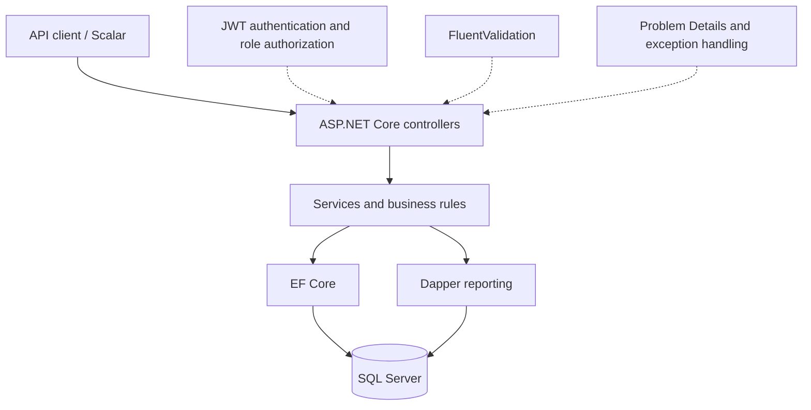
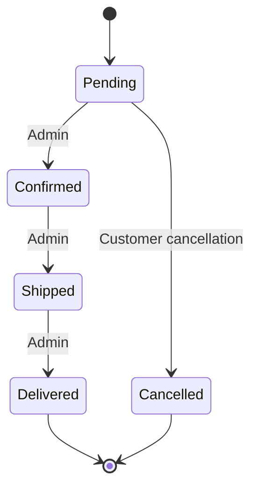
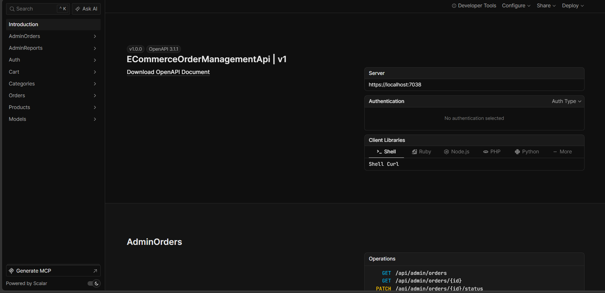
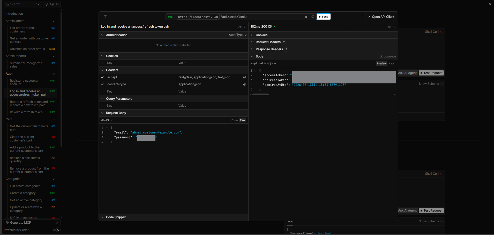
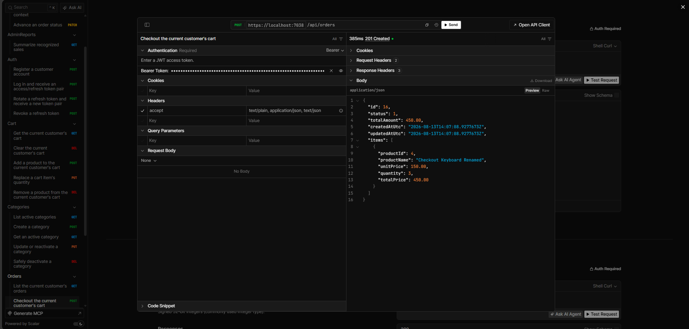
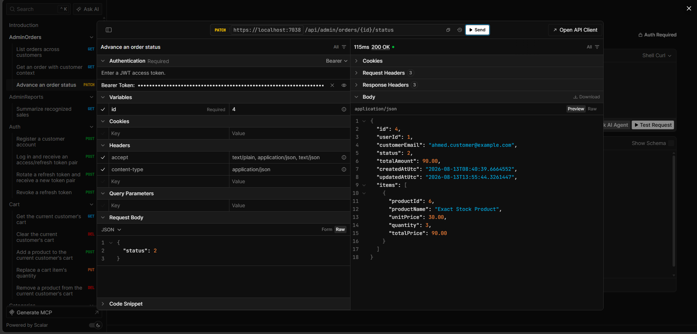
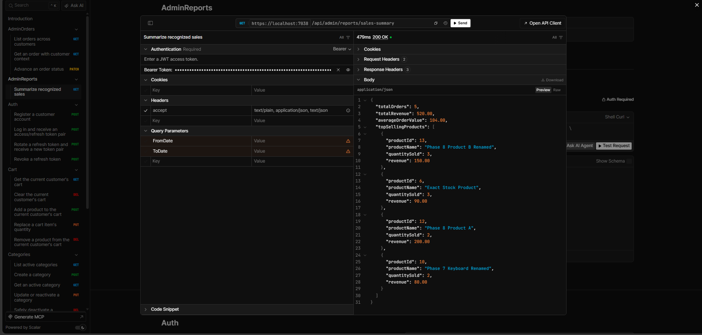

# ASP.NET Core E-Commerce Order Management API

Production-oriented REST API built with ASP.NET Core, EF Core, SQL Server, JWT authentication, transactional checkout, concurrency-safe inventory, historical order snapshots, focused Dapper reporting, FluentValidation, automated tests, and OpenAPI/Scalar documentation.

This portfolio project goes beyond catalog CRUD: it models the consistency and authorization rules involved in turning a customer cart into an order, safely managing inventory, and reporting recognized sales.

## Portfolio highlights

- JWT access-token authentication and Customer/Admin role authorization
- Cryptographically generated refresh tokens stored only as SHA-256 hashes, with rotation, revocation, expiry, and replay rejection
- Server-authoritative checkout: the client never submits prices, totals, customer identity, or order status
- Historical `OrderItem` product-name and unit-price snapshots
- Database transaction around stock reservation, order creation, cart clearing, and commit
- Atomic conditional stock decrements that prevent overselling
- Full rollback when any cart line cannot be reserved
- Customer-owned order access with foreign orders hidden behind `404 Not Found`
- Transactional Pending-to-Cancelled flow with exactly-once inventory restoration
- Conditional Admin status changes so competing cancellation/confirmation requests cannot both win
- Pagination, filtering, search, and deterministic sorting
- EF Core as the primary persistence technology; Dapper limited to reporting
- FluentValidation, safe Problem Details responses, OpenAPI Bearer metadata, Scalar, and relational integration tests

## Technology stack

- .NET SDK 10.0.302 / ASP.NET Core 10
- C# with nullable reference types
- Entity Framework Core 10.0.10 and SQL Server
- Dapper 2.1.79 for the sales report
- JWT Bearer authentication
- FluentValidation 12.1.1
- ASP.NET Core built-in OpenAPI and Scalar 2.16.18
- xUnit, `WebApplicationFactory`, EF Core InMemory, and SQLite integration infrastructure

## Core features

- Customer registration, login, token refresh, and logout
- Admin-managed categories and products with safe deactivation
- Public product browsing with paging, search, filters, and sorting
- Customer cart creation and item management
- Transactional checkout with current availability and stock revalidation
- Customer order history, details, and safe cancellation
- Admin order browsing and controlled status progression
- Admin sales summary with recognized revenue and top-selling products

## Architecture

Controllers remain thin and delegate business rules to application services. Services use the EF Core `AppDbContext` directly; reporting deliberately uses Dapper without replacing normal persistence with a second data-access architecture.



The principal relationships are `User -> Cart -> CartItems -> Product`, `User -> Orders -> OrderItems -> Product`, and `Category -> Products`. Order items retain historical display and monetary values even when the current product changes.

## Important business rules

- Registration always creates a Customer; there is no public Admin-registration path.
- Only Admins can create, update, or deactivate catalog records.
- Inactive products, or products in inactive categories, cannot be browsed, added, or checked out.
- Category deactivation is blocked while it still contains active products.
- Cart totals are informational; authoritative values are captured during checkout.
- A Customer can read only their own orders and cancel only a Pending order.
- Delivered and Cancelled orders are terminal.
- Sales reporting excludes Pending and Cancelled orders.

## Checkout and concurrency design

```text
Customer cart
  -> validate products and category availability
  -> atomically reserve each product's stock
  -> snapshot product names and prices
  -> calculate line totals and order total on the server
  -> create Order and OrderItems
  -> clear CartItems
  -> commit the database transaction
```

Each reservation is a conditional database update equivalent to:

```text
UPDATE Product
SET StockQuantity = StockQuantity - requestedQuantity
WHERE Id = productId
  AND StockQuantity >= requestedQuantity
  AND product/category are active
```

Exactly one affected row means the reservation succeeded. Zero rows means stock or availability changed, so checkout rolls the transaction back. This avoids the unsafe read-then-write race where two requests both observe the same stock.

`OrderItem.UnitPrice`, `OrderItem.ProductName`, and `OrderItem.TotalPrice` are snapshots. `Order.TotalAmount` is the server-calculated sum; no checkout request body or client total is accepted.

## Authentication and authorization

Access tokens contain user identity, email, and role claims. JWT issuer, audience, signature, and lifetime are validated with zero clock skew. Refresh-token values are returned to the client once, while only hashes are persisted. Rotation revokes the used token and links its replacement; replay and expired/revoked tokens are rejected.

Roles:

- `Customer` (`1`): cart, checkout, own-order history, and cancellation
- `Admin` (`2`): catalog management, all-order administration, and reports

## Order lifecycle



Customer cancellation claims `Pending -> Cancelled` with a conditional database update, then restores all item quantities in the same transaction. Admin confirmation also claims the expected current state conditionally. Therefore only one competing transition can succeed, and repeated cancellation cannot restore stock twice.

## Dapper reporting

The Admin sales summary recognizes `Confirmed`, `Shipped`, and `Delivered` orders. It excludes `Pending` and `Cancelled` orders.

- Order totals use historical `Order.TotalAmount`.
- Product revenue uses historical `OrderItem.TotalPrice`.
- Current `Product.Name` is display-only in the top-products list.
- Results can be bounded by inclusive `fromDate` and `toDate` values.
- Dapper is restricted to this parameterized reporting query; EF Core remains the primary persistence mechanism.

## API endpoint overview

### Authentication

| Method | Route | Role | Description |
|---|---|---|---|
| POST | `/api/auth/register` | Anonymous | Register a Customer account |
| POST | `/api/auth/login` | Anonymous | Receive an access/refresh token pair |
| POST | `/api/auth/refresh-token` | Anonymous | Rotate a valid refresh token |
| POST | `/api/auth/logout` | Anonymous | Revoke a refresh token |

### Categories

| Method | Route | Role | Description |
|---|---|---|---|
| GET | `/api/categories` | Anonymous | List active categories |
| GET | `/api/categories/{id}` | Anonymous | Get an active category |
| POST | `/api/categories` | Admin | Create a category |
| PUT | `/api/categories/{id}` | Admin | Update/reactivate a category |
| DELETE | `/api/categories/{id}` | Admin | Safely deactivate a category |

### Products

| Method | Route | Role | Description |
|---|---|---|---|
| GET | `/api/products` | Anonymous | Browse active products |
| GET | `/api/products/{id}` | Anonymous | Get an active product |
| POST | `/api/products` | Admin | Create a product |
| PUT | `/api/products/{id}` | Admin | Update/reactivate a product |
| DELETE | `/api/products/{id}` | Admin | Safely deactivate a product |

Product query parameters: `pageNumber`, `pageSize`, `search`, `categoryId`, `minPrice`, `maxPrice`, `sortBy` (`name`, `price`, `createdAt`, `stock`), and `sortDirection` (`asc`, `desc`).

### Cart

| Method | Route | Role | Description |
|---|---|---|---|
| GET | `/api/cart` | Customer | Get the current cart |
| POST | `/api/cart/items` | Customer | Add a product |
| PUT | `/api/cart/items/{productId}` | Customer | Replace item quantity |
| DELETE | `/api/cart/items/{productId}` | Customer | Remove an item |
| DELETE | `/api/cart` | Customer | Clear the cart |

### Customer orders

| Method | Route | Role | Description |
|---|---|---|---|
| GET | `/api/orders` | Customer | List the current customer's orders |
| GET | `/api/orders/{id}` | Customer | Get an owned order |
| POST | `/api/orders` | Customer | Checkout the current cart; no body |
| POST | `/api/orders/{id}/cancel` | Customer | Cancel a Pending order |

Order-list query parameters: `pageNumber`, `pageSize`, `status`, `fromDate`, and `toDate`.

### Admin orders

| Method | Route | Role | Description |
|---|---|---|---|
| GET | `/api/admin/orders` | Admin | List orders across customers |
| GET | `/api/admin/orders/{id}` | Admin | Get order and customer context |
| PATCH | `/api/admin/orders/{id}/status` | Admin | Advance order status |

Admin-list query parameters additionally include `customerEmail`.

### Reports

| Method | Route | Role | Description |
|---|---|---|---|
| GET | `/api/admin/reports/sales-summary` | Admin | Get recognized sales and top five products |

Report query parameters: optional `fromDate` and `toDate` ISO-8601 values.

## Getting started

Prerequisites: .NET SDK 10.0.302 (or a compatible patch selected by `global.json`) and SQL Server LocalDB or another SQL Server instance.

```powershell
git clone <repository-url>
cd ECommerceOrderManagementApi
dotnet tool restore
dotnet restore
```

### Development configuration with User Secrets

The project has a `UserSecretsId`. Store local credentials outside tracked JSON:

```powershell
dotnet user-secrets set "ConnectionStrings:DefaultConnection" "<your-local-sql-server-connection-string>" --project ./src/ECommerceOrderManagementApi/ECommerceOrderManagementApi.csproj
dotnet user-secrets set "Jwt:Key" "<your-strong-local-signing-key-at-least-32-bytes>" --project ./src/ECommerceOrderManagementApi/ECommerceOrderManagementApi.csproj
```

Committed safe defaults set `Jwt:Issuer` to `ECommerceOrderManagementApi`, `Jwt:Audience` to `ECommerceOrderManagementApi.Client`, access-token lifetime to 15 minutes, and refresh-token lifetime to 7 days. The committed signing key is intentionally empty, so startup fails until a secure local value is supplied.

### Database setup and running the API

The local tool manifest pins `dotnet-ef` 10.0.10, and migrations live under `src/ECommerceOrderManagementApi/Data/Migrations`.

```powershell
dotnet ef database update --project ./src/ECommerceOrderManagementApi/ECommerceOrderManagementApi.csproj --startup-project ./src/ECommerceOrderManagementApi/ECommerceOrderManagementApi.csproj
dotnet run --project ./src/ECommerceOrderManagementApi/ECommerceOrderManagementApi.csproj
```

With the HTTPS launch profile, the API listens at `https://localhost:7038` (and HTTP at `http://localhost:5078`).

## OpenAPI and Scalar

In Development:

- Scalar UI: `https://localhost:7038/scalar/v1`
- OpenAPI document: `https://localhost:7038/openapi/v1.json`

The document defines HTTP Bearer authentication and marks protected operations with a security requirement while leaving registration, login, refresh/logout, and public catalog reads anonymous.

## Representative requests

Login:

```http
POST /api/auth/login
Content-Type: application/json

{
  "email": "customer@example.com",
  "password": "<local-demo-password>"
}
```

Add to cart:

```http
POST /api/cart/items
Authorization: Bearer <access-token>
Content-Type: application/json

{ "productId": 10, "quantity": 2 }
```

Checkout has no client-supplied totals:

```http
POST /api/orders
Authorization: Bearer <access-token>
```

Admin status update (enums use their numeric JSON representation by default: Pending `1`, Confirmed `2`, Shipped `3`, Delivered `4`, Cancelled `5`):

```http
PATCH /api/admin/orders/42/status
Authorization: Bearer <access-token>
Content-Type: application/json

{ "status": 2 }
```

Sales summary response:

```json
{
  "totalOrders": 3,
  "totalRevenue": 300.00,
  "averageOrderValue": 100.00,
  "topSellingProducts": [
    { "productId": 10, "productName": "Keyboard", "quantitySold": 4, "revenue": 300.00 }
  ]
}
```

## Demo workflow

Customer: Register -> Login -> enter the access token in Scalar's Bearer authentication -> browse products -> add an item -> checkout -> view the order -> optionally cancel it while Pending.

Admin: register a normal local account -> promote it only in the development database -> login again for a JWT containing the Admin role -> manage catalog -> view orders -> advance status -> view sales summary.

Development-only Admin promotion after normal registration:

```sql
UPDATE Users
SET Role = 2
WHERE NormalizedEmail = 'ADMIN@EXAMPLE.COM';
```

Run this only against your local development database. Log in again after promotion; existing JWTs retain their original role claim until replaced. The application intentionally has no insecure Admin-registration endpoint.

## Testing

Run the complete suite serially:

```powershell
dotnet test --no-restore -m:1
```

The current suite contains **81 passing tests**. It covers authentication and refresh rotation, authorization, catalog querying, cart isolation, checkout snapshots/totals/rollback, atomic stock behavior, cancellation and status races, reporting rules, validation Problem Details, safe unexpected-exception responses, and OpenAPI security metadata. Relational transaction, conditional-update, order-management, concurrency, and Dapper-reporting scenarios use SQLite integration infrastructure where applicable.

## Project structure

```text
ECommerceOrderManagementApi/
├── .config/                         # local dotnet tool manifest
├── src/ECommerceOrderManagementApi/
│   ├── Configuration/
│   ├── Controllers/
│   ├── Data/                        # DbContext, configurations, migrations
│   ├── DTOs/
│   ├── Entities/
│   ├── Enums/
│   ├── Errors/
│   ├── Interfaces/
│   ├── Services/
│   ├── Validation/
│   └── Program.cs
├── tests/ECommerceOrderManagementApi.Tests/
├── screenshots/
├── ECommerceOrderManagementApi.slnx
├── global.json
└── PROJECT_PLAN.md
```

## Security notes

- Keep `Jwt:Key` and non-local connection strings in User Secrets, environment variables, or a deployment secret store.
- Passwords are handled by ASP.NET Core's password hasher; password hashes are never returned.
- Raw refresh tokens, JWTs, authorization headers, signing keys, and connection strings are not logged.
- Unexpected failures are logged server-side and returned as generic HTTP 500 Problem Details with a trace identifier, without exception, stack, SQL, path, or secret disclosure.
- HTTPS redirection is enabled. Production hosting still requires normal TLS, secret management, database permissions, monitoring, and operational hardening.

## Screenshots

These are genuine captures from the running local Scalar UI.

### API overview



### Authentication



### Transactional checkout



### Admin order management



### Dapper sales reporting



## Scope boundaries

This project intentionally excludes payments, shipping, refunds, discounts, notifications, frontend UI, exports, distributed caching/messaging, microservices, CQRS/MediatR, Docker orchestration, Kubernetes, and additional dashboards/reports. The focus is a coherent order-management backend rather than a full commerce platform.

## Portfolio and freelance relevance

The project demonstrates practical freelance backend capabilities: secure API authentication, relational data modeling, database-backed business workflows, transactional consistency, inventory/order processing, role-based administration, focused reporting, maintainable REST contracts, validation, and automated integration testing.

Suggested portfolio title: **ASP.NET Core E-Commerce Order Management API with Secure Checkout & Inventory Control**.
